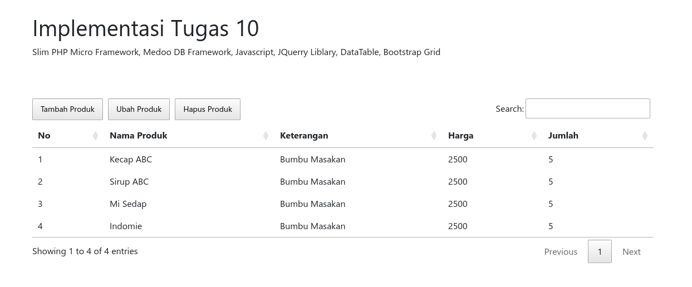

# Implementasi Tugas 10



Dibuat Oleh : Rizqi Pratama  
Dibuat di :
- Fedora 38
- PHP 8.2.7


## Tech Stack
Slim PHP Micro Framework, Medoo DB Framework, Javascript, JQuerry Liblary, DataTable, Bootstrap Grid

## Requirement
- PHP 8.2.7

## How to run
- clone
- composer update
- composer start

## Lain Lain
- Konfigurasi database lihat di ```/src/dependencies.php```
- Database ```/Doc/database.sql```
- Postman Api Collection ```/Doc/LocalhostTesting.postman_collection.json```